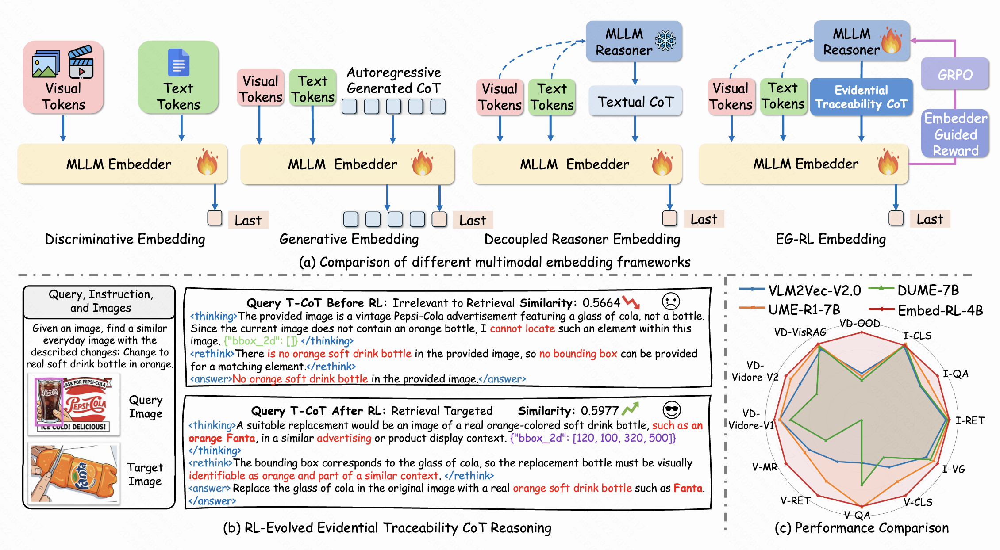
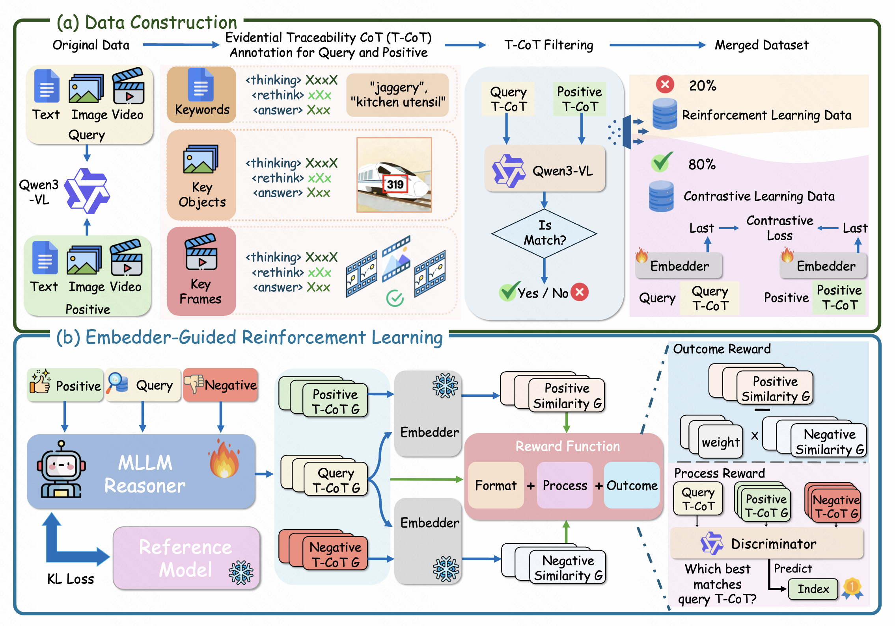
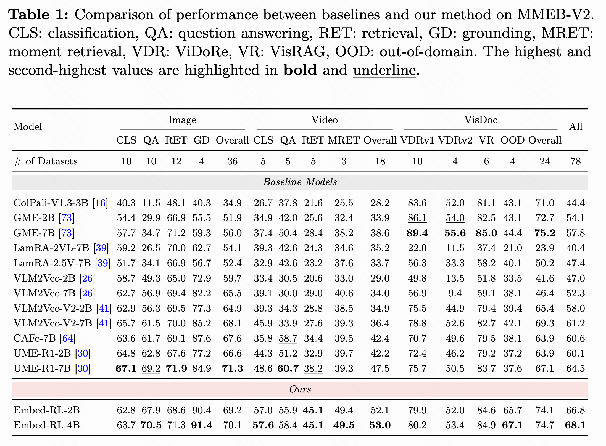

# Embed-RL: Reinforcement Learning for Reasoning-Driven Multimodal Embeddings
<div align="center">

[](https://huggingface.co/ZoengHouNaam/Embed-RL-2B)
[](https://huggingface.co/ZoengHouNaam/Embed-RL-4B)
[](https://arxiv.org/abs/2602.13823)

</div>

### Authors & Affiliations
**Authors**: Haonan Jiang¹²*、Yuji Wang¹²*、Yongjie Zhu²†、Xin Lu²、Wenyu Qin²、Meng Wang²、Pengfei Wan²、Yansong Tang¹‡  
**Affiliations**: ¹Tsinghua Shenzhen International Graduate School, Tsinghua University；²Kling Team, Kuaishou Technology  

**Emails**:  
{jiang-hn24[AT]mails, yuji-wan24[AT]mails, tang.yansong[AT]sz}.tsinghua.edu.cn  
{zhuyongjie, luxin09, qinwenyu, wangmeng46, wanpengfei}[AT]kuaishou.com  

*Equal Contribution. Work done during an internship at Kuaishou Technology. †Project Leader. ‡Corresponding Author.

## 📖 Abstract
Leveraging Multimodal Large Language Models (MLLMs) has become pivotal for advancing Universal Multimodal Embeddings (UME) in addressing diverse cross-modal tasks. Recent studies demonstrate that incorporating generative Chain-of-Thought (CoT) reasoning can substantially enhance task-specific representations compared to discriminative methods. However, the generated reasoning CoTs of existing generative embedding methods are limited to the textual analysis of queries and are irrelevant to the retrieval of the targets.

To address these limitations, we propose a reasoning-driven UME framework that integrates **Embedder-Guided Reinforcement Learning (EG-RL)** to optimize the Reasoner to produce **evidential Traceability CoT (T-CoT)**. Our key contributions are threefold:
1. We design an EG-RL framework where the Embedder provides explicit supervision to the Reasoner, ensuring the generated CoT traces are aligned with embedding tasks.
2. We introduce T-CoT, which extracts critical multimodal cues to focus on retrieval-relevant elements and provides multimodal inputs for the Embedder.
3. With limited computational resources, our framework outperforms the pioneering embedding model on both MMEB-V2 and UVRB benchmarks.

The integration of multimodal evidence in structured reasoning, paired with retrieval-oriented alignment, effectively strengthens cross-modal semantic consistency and boosts the model’s fine-grained matching capability as well as its generalization across complex scenarios. Our work demonstrates that targeted reasoning optimization can significantly improve multimodal embedding quality, providing a practical and efficient solution for reasoning-driven UME development.

## 🛠️ Method
<div align="center">
  
  <p><em>Figure 1: Multimodal embedding optimization via Embedder-Guided Reinforcement Learning.</em></p>
</div>

<div align="center">
  
  <p><em>Figure 2: Overview of the proposed data synthesis and EG-RL framework.</em></p>
</div>

## 📊 Results
<div align="center">
  
</div>

## 🚀 Training
The complete training code and detailed implementation guidelines will be released in the repository to facilitate reproducibility and further research on reasoning-driven multimodal embeddings. Key components of the training framework include:
- Multi-node Grad Cache distributed contrastive learning framework based on Qwen-3VL
- Curated training datasets tailored for reasoning-driven multimodal embedding optimization
- Reinforcement learning framework built upon Qwen-3VL for optimizing the generation of Traceability CoT (T-CoT)
- VLLM-based suspended service concurrent framework for Qwen-3VL to extract embeddings corresponding to the special token `<emb>`


## 🚀 Evaluation
### 1. Environment Setup
```bash
# Create and activate conda environment
conda create -n embed-rl python=3.10 -y
conda activate embed-rl

# Install dependencies
bash setup.sh
```

### 2. Weight Organization
Please organize the model weights in the following directory structure:
```
./ckpt/
├── Embed-RL-2B/  # Embed-RL-2B model weights
└── Embed-RL-4B/  # Embed-RL-4B model weights
```

### 3. Run Evaluation
#### Image Embedding Similarity Test
```bash
CUDA_VISIBLE_DEVICES=0 python ./eval/image_eval.py
```

#### Video Embedding Similarity Test
```bash
CUDA_VISIBLE_DEVICES=0 python ./eval/video_eval.py
```

## 📄 Citation
```bibtex
@article{jiang2026embed,
  title={Embed-RL: Decoupled Reinforcement Learning for Reasoning-Driven Multimodal Embeddings},
  author={Jiang, Haonan and Wang, Yuji and Zhu, Yongjie and Lu, Xin and Qin, Wenyu and Wang, Meng and Wan, Pengfei and Tang, Yansong},
  journal={arXiv preprint arXiv:2602.13823},
  year={2026}
}
```
